# Nano-GraphRAG Pipeline Diagrams

This document contains Mermaid diagrams visualizing the main pipelines in nano-graphrag.

---

## 1. Document Insertion Pipeline

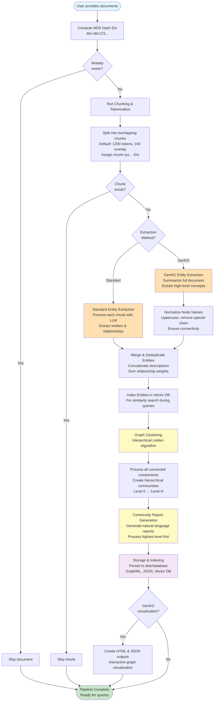

---

## 2. Community Creation Pipeline (Detailed)

### Phase 1: Graph Clustering

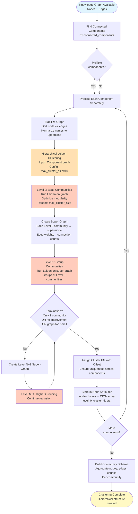

### Phase 2: Report Generation

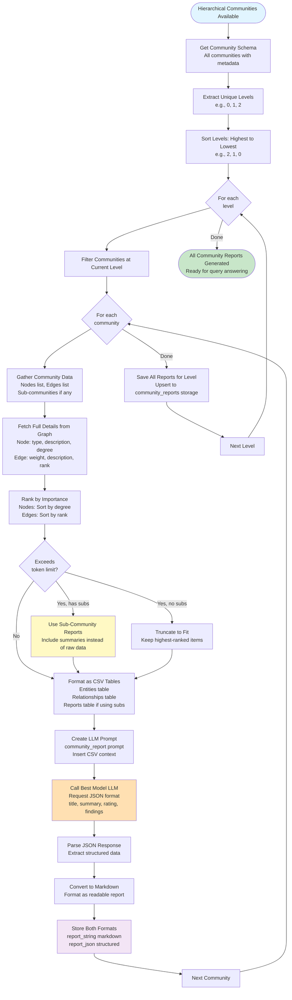

---

## 3. Local Search Pipeline

```mermaid
flowchart TD
    Start([User Query:<br/>How does backpropagation work?]) --> Embed[Embed Query<br/>Convert to vector representation]

    Embed --> SearchVDB[Search Entity Vector DB<br/>Find top K similar entities<br/>Default: top_k=20]

    SearchVDB --> ResultEntities[Retrieved Entities<br/>BACKPROPAGATION 0.89<br/>GRADIENT DESCENT 0.76<br/>NEURAL NETWORK 0.74<br/>...]

    ResultEntities --> GetDetails[Get Full Entity Details<br/>Fetch from graph storage<br/>Get node degree connectivity]

    GetDetails --> GetCommunities[Find Related Communities<br/>Parse clusters from entities<br/>Filter by level ≤ query level]

    GetCommunities --> RankComm[Rank Communities<br/>Sort by occurrence count<br/>Sort by rating]

    RankComm --> TruncComm[Truncate to Token Budget<br/>Max: 3200 tokens<br/>Keep highest-ranked]

    TruncComm --> GetEdges[Find Related Relationships<br/>Get edges connected to entities<br/>Add edge weight & description]

    GetEdges --> RankEdges[Rank Relationships<br/>Sort by rank degree src + degree tgt<br/>Truncate to 4800 tokens]

    RankEdges --> ChunksCheck{Include<br/>text chunks?}

    ChunksCheck -->|Yes| GetChunks[Get Original Text Chunks<br/>Parse source_id from entities<br/>Fetch from text_chunks storage]
    ChunksCheck -->|No| FormatContext

    GetChunks --> RankChunks[Rank Text Chunks<br/>Sort by chunk order<br/>Truncate to 4000 tokens]

    RankChunks --> FormatContext[Format Context as CSV Tables<br/>Reports table<br/>Entities table<br/>Relationships table<br/>Sources table if included]

    FormatContext --> BuildPrompt[Build LLM Prompt<br/>local_rag_response system prompt<br/>Insert context tables<br/>Add user query]

    BuildPrompt --> CallLLM[Call Best Model LLM<br/>Single pass generation<br/>No special format required]

    CallLLM --> Answer[Generate Detailed Answer<br/>Based on local context<br/>Cites specific entities/relationships]

    Answer --> End([Return Answer to User<br/>Focused, detailed response])

    style Start fill:#e1f5ff
    style End fill:#c8e6c9
    style SearchVDB fill:#ffe0b2
    style CallLLM fill:#ffe0b2
    style GetCommunities fill:#fff9c4
    style GetEdges fill:#fff9c4
    style GetChunks fill:#f3e5f5
```

---

## 4. Global Search Pipeline

```mermaid
flowchart TD
    Start([User Query:<br/>What are the main themes?]) --> GetAll[Get All Communities<br/>Retrieve community schema<br/>From graph storage]

    GetAll --> FilterLevel[Filter by Level<br/>Keep communities where<br/>level ≤ query level default 2]

    FilterLevel --> RankOccur[Rank by Importance<br/>Sort by occurrence<br/>How much of graph they cover]

    RankOccur --> SelectTop[Select Top N Communities<br/>Default: top 512<br/>Filter by min rating ≥ 0]

    SelectTop --> GetReports[Retrieve Community Reports<br/>Fetch full report_string<br/>From community_reports storage]

    GetReports --> GroupComm[Group Communities by Token Budget<br/>Split into groups that fit<br/>Max: 16384 tokens per group]

    GroupComm --> GroupList[Groups Created<br/>Group 1: Communities 0-30<br/>Group 2: Communities 31-65<br/>Group 3: Communities 66-95<br/>...]

    GroupList --> MapPhase[MAP PHASE: Process Each Group]

    MapPhase --> LoopGroups{For each<br/>group}

    LoopGroups --> FormatGroup[Format Group as CSV<br/>id, content, rating, importance<br/>All community reports in group]

    FormatGroup --> MapPrompt[Create Map Prompt<br/>global_map_rag_points system prompt<br/>Request JSON key points<br/>Each with description & score]

    MapPrompt --> MapLLM[Call Best Model LLM<br/>Extract key points from group<br/>Return JSON array]

    MapLLM --> ParsePoints[Parse JSON Response<br/>Extract points with scores]

    ParsePoints --> NextGroup[Next Group]
    NextGroup --> LoopGroups

    LoopGroups -->|Done| ReducePhase[REDUCE PHASE: Combine All Points]

    ReducePhase --> Aggregate[Aggregate All Points<br/>From all groups<br/>Label with analyst ID]

    Aggregate --> FilterScore[Filter Low-Score Points<br/>Keep only score > 0]

    FilterScore --> RankPoints[Rank All Points<br/>Sort by importance score<br/>Highest first]

    RankPoints --> TruncPoints[Truncate to Token Budget<br/>Max: 16384 tokens<br/>Keep highest-scored]

    TruncPoints --> FormatAnalysts[Format as Analyst Reports<br/>----Analyst 0----<br/>Importance Score: 85<br/>Description...<br/>...]

    FormatAnalysts --> ReducePrompt[Create Reduce Prompt<br/>global_reduce_rag_response<br/>Synthesize all perspectives<br/>Insert analyst reports]

    ReducePrompt --> ReduceLLM[Call Best Model LLM<br/>Generate comprehensive synthesis<br/>Combine multiple viewpoints]

    ReduceLLM --> FinalAnswer[Generate Comprehensive Answer<br/>Synthesizes patterns across graph<br/>Multiple perspectives integrated]

    FinalAnswer --> End([Return Answer to User<br/>Broad, thematic response])

    style Start fill:#e1f5ff
    style End fill:#c8e6c9
    style MapPhase fill:#fff9c4
    style ReducePhase fill:#fff9c4
    style MapLLM fill:#ffe0b2
    style ReduceLLM fill:#ffe0b2
    style GroupComm fill:#f3e5f5
```

---

## 5. Comparison: Local vs. Global Search Flow

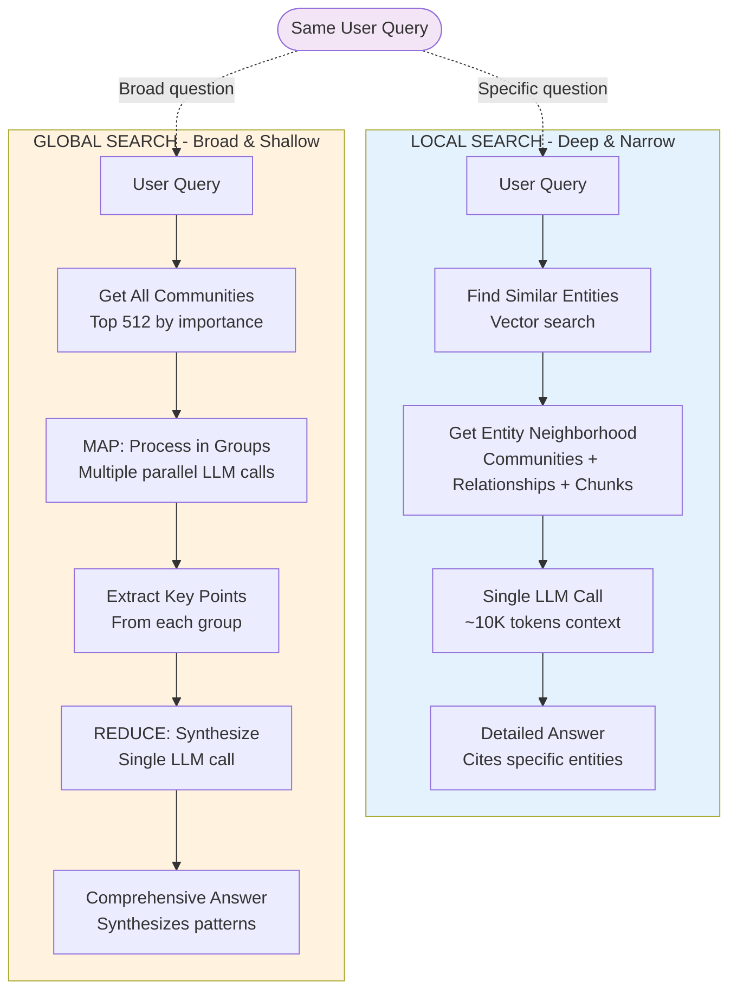

---

## 6. Entity Extraction Methods Comparison

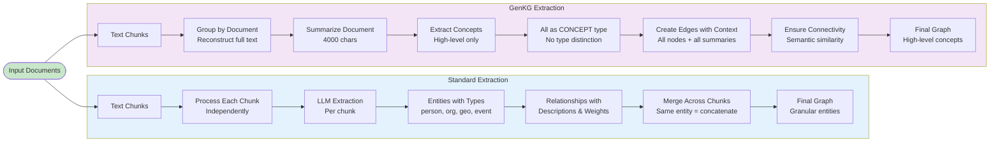

---

## 7. Hierarchical Leiden Clustering (Detailed)

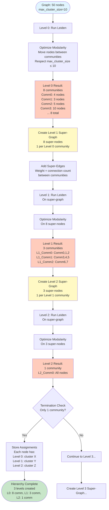

---

## 8. Data Flow: Document to Query

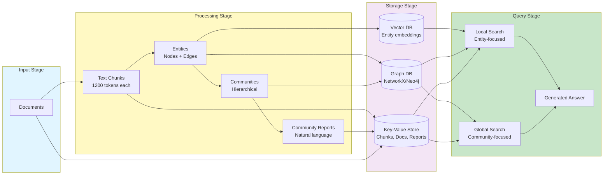

---

## 9. Token Budget Management in Local Search

```mermaid
flowchart TD
    Start([Total Budget: 12,000 tokens]) --> Split[Split Budget:<br/>Text Chunks: 4,000<br/>Relationships: 4,800<br/>Community Reports: 3,200]

    Split --> GetData[Fetch All Data:<br/>100 potential entities<br/>300 potential edges<br/>50 potential chunks<br/>5 potential communities]

    GetData --> RankEnt[Rank Entities<br/>By node degree<br/>connectivity]

    RankEnt --> TruncEnt{Entities fit<br/>in budget?}

    TruncEnt -->|No| KeepTop[Keep Top N Entities<br/>Until 4,000 token limit]
    TruncEnt -->|Yes| AllEnt[Keep All Entities]

    KeepTop --> RankEdge[Rank Edges<br/>By rank src + tgt degree]
    AllEnt --> RankEdge

    RankEdge --> TruncEdge{Edges fit<br/>in budget?}

    TruncEdge -->|No| KeepTopEdge[Keep Top N Edges<br/>Until 4,800 token limit]
    TruncEdge -->|Yes| AllEdge[Keep All Edges]

    KeepTopEdge --> RankComm[Rank Communities<br/>By occurrence & rating]
    AllEdge --> RankComm

    RankComm --> TruncComm{Communities fit<br/>in budget?}

    TruncComm -->|No| KeepTopComm[Keep Top N Communities<br/>Until 3,200 token limit]
    TruncComm -->|Yes| AllComm[Keep All Communities]

    KeepTopComm --> CheckChunks{Include<br/>text chunks?}
    AllComm --> CheckChunks

    CheckChunks -->|Yes| RankChunks[Rank Chunks<br/>By order & relation count]
    CheckChunks -->|No| Format

    RankChunks --> TruncChunks{Chunks fit<br/>in budget?}

    TruncChunks -->|No| KeepTopChunks[Keep Top N Chunks<br/>Until 4,000 token limit]
    TruncChunks -->|Yes| AllChunks[Keep All Chunks]

    KeepTopChunks --> Format[Format as Context<br/>CSV tables for LLM]
    AllChunks --> Format

    Format --> Verify{Total tokens<br/>≤ 12,000?}

    Verify -->|Yes| Send[Send to LLM<br/>Generate answer]
    Verify -->|No| Error[Error: Budget exceeded<br/>Should not happen]

    Send --> End([Answer Generated])

    style Start fill:#e1f5ff
    style End fill:#c8e6c9
    style TruncEnt fill:#ffccbc
    style TruncEdge fill:#ffccbc
    style TruncComm fill:#ffccbc
    style TruncChunks fill:#ffccbc
    style Send fill:#ffe0b2
```

---

## 10. Map-Reduce in Global Search (Detailed)

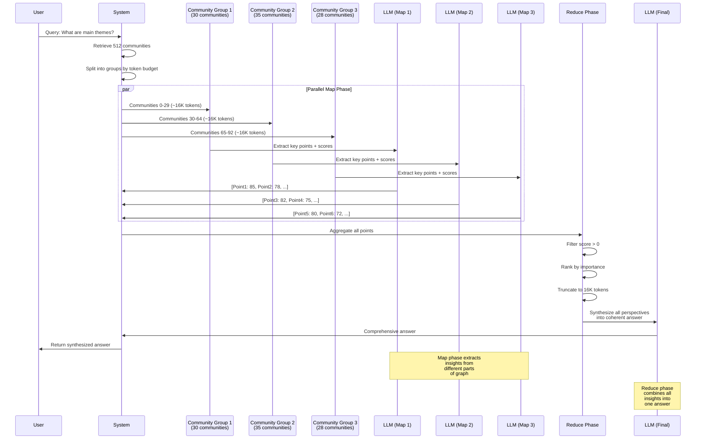

---

## Notes on Diagram Usage

### Viewing Mermaid Diagrams

These diagrams can be viewed in:
- **GitHub**: Automatically renders Mermaid diagrams in `.md` files
- **VS Code**: Install "Markdown Preview Mermaid Support" extension
- **Mermaid Live Editor**: Copy-paste code to https://mermaid.live
- **GitLab**: Native Mermaid support in markdown
- **Notion, Obsidian**: Support Mermaid rendering

### Diagram Legend

- **Light Blue** (`#e1f5ff`): Start/Input nodes
- **Light Green** (`#c8e6c9`): End/Output nodes
- **Light Yellow** (`#fff9c4`): Important processing steps
- **Light Orange** (`#ffe0b2`): LLM operations
- **Light Purple** (`#f3e5f5`): Storage/Database operations
- **Light Red** (`#ffccbc`): Truncation/Filtering operations

### Customization

To modify these diagrams:
1. Copy the Mermaid code block
2. Paste into Mermaid Live Editor
3. Edit the flowchart
4. Copy the updated code back

### Related Documentation

- `document_insertion_pipeline.md`: Detailed text explanation of insertion pipeline
- `community_creation_flowchart.md`: ASCII flowcharts for community creation
- `query_modes_explained.md`: Detailed explanation of local vs. global search
